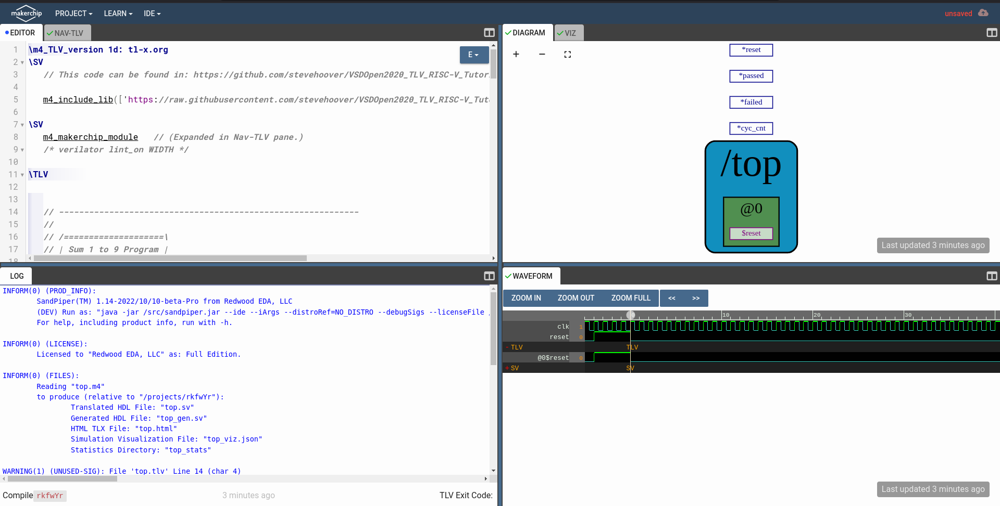
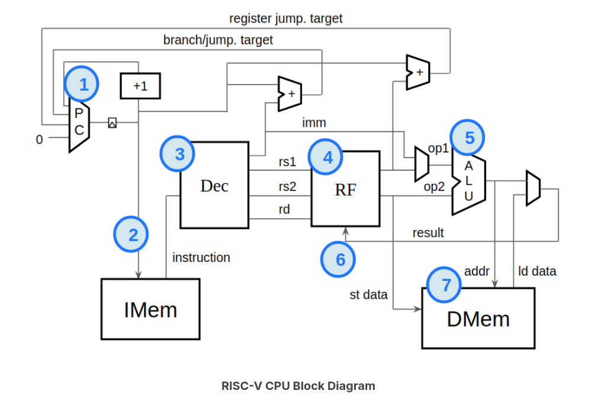

# RISC-V-Test
## How-to-view

Head over to [MakerchipIDE](https://makerchip.com/sandbox/#) and you will be able to view the "EDITOR", "NAV-TLV", "LOG" on the left half of the screen.
Towards your right will be the "DIAGRAM", "VIZ", "WAVEFORM". You can adjust the screen to your preference by splitting it the way you want to using the icon present on
the top right corner of the panel. 

[!TIP]
Ideally it's nice to have the screen in this format.  

Simply head into the Basic-CPU-Core folder and copy paste the source code into the "EDITOR" window. Now you can either go the same icon present on the top right corner of the panel or press "Ctrl + Enter" to compile and simulate your source code. The "DIAGRAM", "VIZ", "WAVEFORM" gets updated and the functionality of the CPU is clearly seen in the "VIZ" tab (Visualization).

## Block-Diagram

## What's next?

Building this simple RISC CPU core taught me how much understanding and learning is required, even for something seemingly straightforward. Moving forward, I plan to implement the complete RV32I ISA, taking the design to a whole new level by building a more advanced processor. Alongside this, I will embark on additional exciting projects centered around the RISC-V architecture. 

