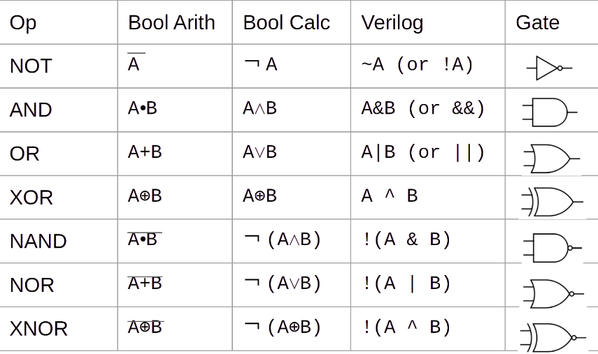

# RISC-V-Test

## Boolean Expressions in TL-Verilog



### TL-Verilog syntax 

In TL-Verilog, the most common data types are booleans (as you used in the previous lab) and bit vectors. A vector is declared by providing a bit range in its assignment as so:

``` 
$vect[7:0] = ....;

```

Bit ranges are generally not required on the right-hand side of an expression. When they are used, they extract a subrange of bits from a vector signal.

